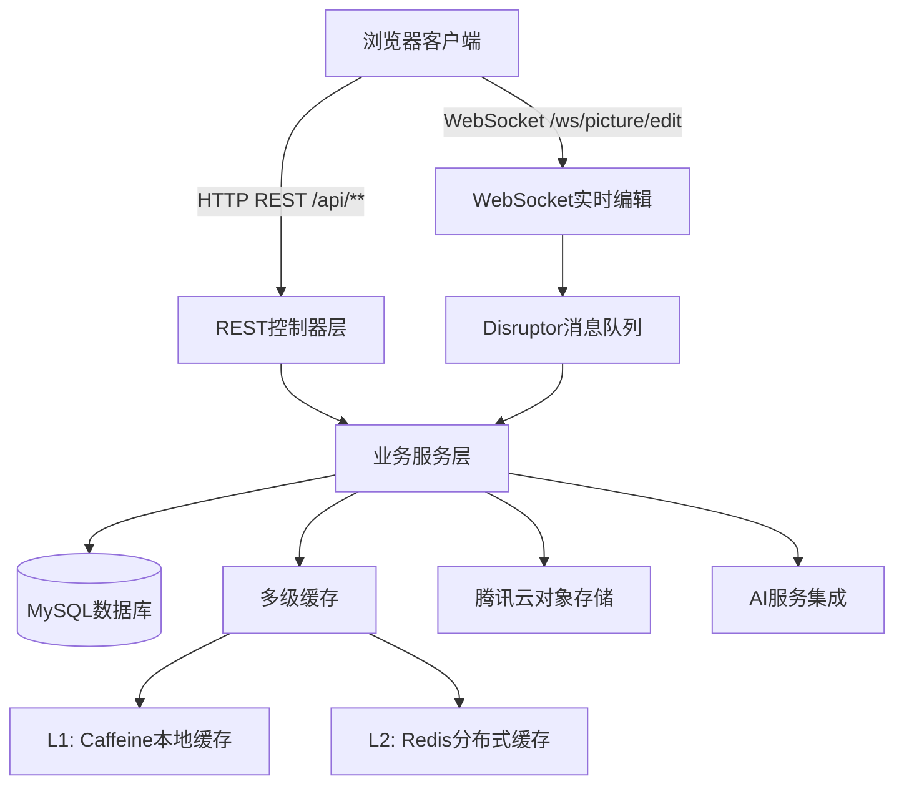

# 本文由[](https://deepwiki.com/WeiWu-code/picture-gallery)生成，详情可点击查看

# Picture Gallery - 智能图片库管理系统

一个基于Spring Boot的企业级图片库管理系统，集成AI智能分析、实时协作编辑和多级缓存等现代化特性。

## ✨ 核心亮点

### 🤖 AI智能集成
- **腾讯混元大模型**：自动分析图片内容，生成标签、分类和描述 [1](#0-0) 
- **阿里云DashScope**：AI扩图功能，智能扩展图片边界
- **360搜图API**：以图搜图功能，快速找到相似图片 [2](#0-1) 

### ⚡ 高性能架构
- **多级缓存系统**：L1(Caffeine) + L2(Redis)两级缓存，支持分布式缓存同步 [3](#0-2) 
- **实时协作编辑**：基于WebSocket + LMAX Disruptor的高性能实时编辑 [4](#0-3) 
- **异步处理**：文件清理等耗时操作异步执行，提升响应速度 [5](#0-4) 

### 🔐 完善的权限体系
- **Sa-Token认证**：基于Redis的会话管理和权限认证 [6](#0-5) 
- **空间级权限控制**：支持私有空间和团队协作空间，细粒度权限管理
- **审核机制**：图片上传后可设置审核状态，支持管理员审核 [7](#0-6) 

## 🏗️ 系统架构



## 📊 数据模型

系统采用四表设计，支持逻辑删除和软删除机制 [8](#0-7) ：

- **user表**：用户信息和角色管理
- **picture表**：图片元数据和审核状态
- **space表**：空间配置和配额管理
- **space_user表**：空间成员和权限映射

## 🚀 快速开始

### 环境要求
- Java 11+
- MySQL 8.0+
- Redis 6.0+
- Maven 3.6+

### 安装步骤

1. **克隆项目**
```bash
git clone https://github.com/WeiWu-code/picture-gallery.git
cd picture-gallery
```

2. **配置数据库**
```bash
# 创建数据库
mysql -u root -p < sql/init.sql
```

3. **配置应用**
```bash
# 复制配置文件
cp src/main/resources/application-local.yml.example src/main/resources/application-local.yml
# 编辑配置文件，填入数据库、Redis、云服务密钥等
```

4. **启动应用**
```bash
mvn spring-boot:run
```

5. **访问应用**
    - API文档：http://localhost:8123/api/doc.html
    - 接口地址：http://localhost:8123/api

## 📋 核心功能

### 图片管理
- **多种上传方式**：支持文件上传和URL上传 [9](#0-8) 
- **智能标签**：AI自动生成图片标签、分类和描述 [10](#0-9) 
- **批量操作**：支持批量上传、编辑和删除
- **颜色搜索**：基于主色调的图片搜索功能

### 空间管理
- **多级空间**：支持公共空间、私有空间和团队空间
- **配额控制**：空间大小和数量限制 [11](#0-10) 
- **权限管理**：查看者、编辑者、管理员三级权限

### 实时协作
- **多人编辑**：WebSocket实现的实时图片编辑协作
- **状态同步**：编辑状态实时广播给所有参与者
- **高性能**：Disruptor队列确保高并发下的稳定性

## 🛠️ 技术栈

| 层级 | 技术选型 | 版本 |
|------|----------|------|
| 框架 | Spring Boot | 2.7.6 |
| 语言 | Java | 11 |
| 数据库 | MySQL | 8.0+ |
| 缓存 | Redis + Caffeine | 6.0+ / 3.1.8 |
| ORM | MyBatis-Plus | 3.5.9 |
| 认证 | Sa-Token | 1.39.0 |
| 存储 | 腾讯云COS | 5.6.227 |
| 文档 | Knife4j | 4.4.0 |

## 📝 API文档

项目集成Knife4j，提供完整的API文档 [12](#0-11) ：

- 访问地址：http://localhost:8123/api/doc.html
- 支持在线调试和接口测试

## 🤝 贡献指南

欢迎提交Issue和Pull Request来改进项目！
